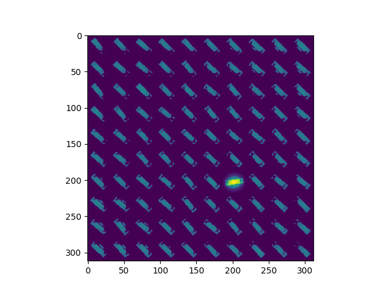

# saliency1998

Unfinished project that tests Saliency map:

## Testing pop up effect

Itti, L., & Koch, C. (1999, May). Comparison of feature combination strategies for saliency-based visual attention systems. 
In Human vision and electronic imaging IV (Vol. 3644, pp. 473-482). SPIE.
